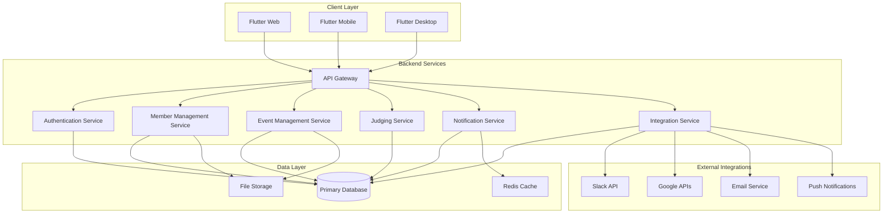

# Design Document

## Overview

Ngage is a multi-platform engagement application built with Flutter for web and mobile, designed to support team-based competitions, events, and social interactions across corporate, educational, and community contexts. The platform features a sophisticated multi-profile user system, comprehensive team management, event lifecycle management, and extensive integration capabilities.

### UI Design Changes

The group detail screen has been updated to focus on core functionality:
- **Leaderboard Tab**: Displays group-specific leaderboards from completed events
- **Events Tab**: Shows all events within the group with filtering and search capabilities
- Removed overview and members tabs to streamline the interface

## Architecture

### High-Level Architecture



### Technology Stack

**Frontend:**
- Flutter (Web, iOS, Android, Desktop)
- State Management: Riverpod
- UI Framework: Material 3
- Real-time Updates: WebSocket/Server-Sent Events

**Backend:**
- Firebase (Authentication, Firestore, Cloud Functions, Storage)
- Alternative: Supabase for open-source option
- Real-time Database: Firestore with real-time listeners
- File Storage: Firebase Storage with CDN

**Integrations:**
- Slack SDK for OAuth and bot functionality
- Google APIs for authentication and calendar
- SendGrid for email notifications
- Firebase Cloud Messaging for push notifications

## Components and Interfaces

### 1. Authentication System

```dart
// Core authentication interfaces
abstract class AuthService {
  Future<User> signInWithEmail(String email, String password);
  Future<User> signInWithPhone(String phone, String verificationCode);
  Future<User> signInWithGoogle();
  Future<User> signInWithSlack(String code);
  Future<void> signOut();
  Stream<User?> get authStateChanges;
}

abstract class MemberClaimService {
  Future<List<Member>> claimMemberProfiles(User user);
  Future<Member> createBasicMemberProfile(User user);
  Future<void> setDefaultMember(String userId, String memberId);
}
```

### 2. Member Management System

```dart
// Member profile management
abstract class MemberService {
  Future<List<Member>> getUserMembers(String userId);
  Future<Member> getCurrentMember(String userId);
  Future<void> switchDefaultMember(String userId, String memberId);
  Future<void> updateMemberProfile(String memberId, MemberUpdateData data);
}

abstract class BulkImportService {
  Future<ImportResult> importMembers(List<MemberImportData> members);
  Future<List<Member>> findUnclaimedMembers(String email, String? phone);
  Future<void> validateImportData(List<MemberImportData> members);
}
```

### 3. Group and Team Management

```dart
// Group management interfaces
abstract class GroupService {
  Future<Group> createGroup(CreateGroupData data);
  Future<void> addMemberToGroup(String groupId, String memberId, GroupRole role);
  Future<List<Group>> getMemberGroups(String memberId);
  Future<void> updateGroupSettings(String groupId, GroupSettings settings);
}

abstract class TeamService {
  Future<Team> createTeam(CreateTeamData data);
  Future<void> addMemberToTeam(String teamId, String memberId);
  Future<void> removeMemberFromTeam(String teamId, String memberId);
  Future<List<Team>> getGroupTeams(String groupId);
}
```

### 4. Event Management System

```dart
// Event lifecycle management
abstract class EventService {
  Future<Event> createEvent(CreateEventData data);
  Future<void> scheduleEvent(String eventId, DateTime startTime, DateTime endTime);
  Future<void> updateEventStatus(String eventId, EventStatus status);
  Future<Event> cloneEvent(String eventId, CloneEventData data);
  Future<List<Event>> getGroupEvents(String groupId);
}

abstract class SubmissionService {
  Future<Submission> createSubmission(CreateSubmissionData data);
  Future<void> uploadSubmissionFiles(String submissionId, List<File> files);
  Future<void> submitEntry(String submissionId);
  Future<List<Submission>> getEventSubmissions(String eventId);
}
```

### 5. Judging System

```dart
// Judging and scoring interfaces
abstract class JudgingService {
  Future<void> scoreSubmission(String submissionId, String judgeId, ScoreData score);
  Future<List<Score>> getSubmissionScores(String submissionId);
  Future<void> addJudgeComment(String submissionId, String judgeId, String comment);
  Future<Leaderboard> calculateLeaderboard(String eventId);
}

abstract class ScoringRubricService {
  Future<ScoringRubric> createRubric(CreateRubricData data);
  Future<List<ScoringRubric>> getEventRubrics(String eventId);
  Future<void> applyRubricToEvent(String eventId, String rubricId);
}
```

## Data Models

### Core Data Models

```dart
// User authentication model
class User {
  final String id;
  final String email;
  final String? phone;
  final String? defaultMember; // Foreign key to Members
  final DateTime createdAt;
  final DateTime updatedAt;
}

// Member profile model
class Member {
  final String id;
  final String? userId; // Nullable until claimed
  final String email;
  final String? phone;
  final String? externalId; // For bulk imports
  final String firstName;
  final String lastName;
  final String? category; // Department/House/Division
  final String? title; // Job title/Role/Year level
  final String? profilePhoto;
  final String? bio;
  final bool isActive;
  final DateTime? importedAt;
  final DateTime? claimedAt;
  final DateTime createdAt;
  final DateTime updatedAt;
}

// Group model
class Group {
  final String id;
  final String name;
  final String description;
  final GroupType groupType; // corporate, educational, community, social
  final Map<String, dynamic> settings;
  final String createdBy; // Member ID
  final DateTime createdAt;
  final DateTime updatedAt;
}

// Team model
class Team {
  final String id;
  final String groupId;
  final String name;
  final String description;
  final String teamLeadId; // Member ID
  final List<String> memberIds; // List of Member IDs
  final int? maxMembers;
  final String? teamType;
  final bool isActive;
  final DateTime createdAt;
  final DateTime updatedAt;
}

// Event model
class Event {
  final String id;
  final String groupId;
  final String title;
  final String description;
  final EventType eventType; // competition, challenge, survey
  final EventStatus status; // draft, scheduled, active, completed, cancelled
  final DateTime? startTime;
  final DateTime? endTime;
  final DateTime? submissionDeadline;
  final List<String>? eligibleTeamIds;
  final Map<String, dynamic> judgingCriteria;
  final String createdBy; // Member ID
  final DateTime createdAt;
  final DateTime updatedAt;
}

// Submission model
class Submission {
  final String id;
  final String eventId;
  final String teamId;
  final String submittedBy; // Member ID
  final Map<String, dynamic> content; // Photos, videos, text
  final SubmissionStatus status; // draft, submitted, under_review, approved, rejected
  final DateTime? submittedAt;
  final DateTime createdAt;
  final DateTime updatedAt;
}
```

### Supporting Models

```dart
// Group membership with roles
class GroupMember {
  final String id;
  final String groupId;
  final String memberId;
  final GroupRole role; // admin, judge, team_lead, member
  final DateTime joinedAt;
  final DateTime createdAt;
}

// Scoring and judging models
class Score {
  final String id;
  final String submissionId;
  final String judgeId; // Member ID
  final Map<String, dynamic> scores; // Flexible scoring structure
  final String? comments;
  final DateTime createdAt;
  final DateTime updatedAt;
}

// Notification model
class Notification {
  final String id;
  final String recipientId; // Member ID
  final NotificationType type;
  final String title;
  final String message;
  final Map<String, dynamic>? data;
  final bool isRead;
  final DateTime createdAt;
}
```

## Error Handling

### Error Categories

1. **Authentication Errors**
   - Invalid credentials
   - Expired tokens
   - OAuth failures
   - Account lockouts

2. **Authorization Errors**
   - Insufficient permissions
   - Role-based access violations
   - Group membership requirements

3. **Data Validation Errors**
   - Invalid input formats
   - Missing required fields
   - Business rule violations
   - File upload constraints

4. **System Errors**
   - Database connection failures
   - External service unavailability
   - Rate limiting
   - Storage quota exceeded

### Error Handling Strategy

```dart
// Centralized error handling
class ErrorHandler {
  static void handleError(Exception error, StackTrace stackTrace) {
    // Log error with context
    Logger.error(error, stackTrace);
    
    // Categorize and respond appropriately
    if (error is AuthenticationException) {
      _handleAuthError(error);
    } else if (error is ValidationException) {
      _handleValidationError(error);
    } else if (error is NetworkException) {
      _handleNetworkError(error);
    } else {
      _handleGenericError(error);
    }
  }
  
  static void _showUserFriendlyMessage(String message) {
    // Display appropriate user message
    NotificationService.showError(message);
  }
}

// Custom exception types
class AuthenticationException extends Exception {
  final String message;
  final AuthErrorType type;
  AuthenticationException(this.message, this.type);
}

class ValidationException extends Exception {
  final String field;
  final String message;
  ValidationException(this.field, this.message);
}
```

## Testing Strategy

### Testing Pyramid

1. **Unit Tests (70%)**
   - Business logic validation
   - Data model testing
   - Service layer testing
   - Utility function testing

2. **Integration Tests (20%)**
   - API endpoint testing
   - Database integration testing
   - External service integration testing
   - Authentication flow testing

3. **End-to-End Tests (10%)**
   - Critical user journey testing
   - Cross-platform compatibility testing
   - Performance testing
   - Security testing

### Test Implementation

```dart
// Example unit test structure
class MemberServiceTest {
  late MemberService memberService;
  late MockDatabase mockDatabase;
  
  setUp() {
    mockDatabase = MockDatabase();
    memberService = MemberService(mockDatabase);
  }
  
  testClaimMemberProfiles() async {
    // Arrange
    final user = createTestUser();
    final unclaimedMembers = createTestMembers();
    when(mockDatabase.findUnclaimedMembers(any, any))
        .thenAnswer((_) async => unclaimedMembers);
    
    // Act
    final result = await memberService.claimMemberProfiles(user);
    
    // Assert
    expect(result.length, equals(unclaimedMembers.length));
    verify(mockDatabase.updateMemberUserId(any, any)).called(unclaimedMembers.length);
  }
}

// Integration test example
class AuthenticationIntegrationTest {
  testSlackOAuthFlow() async {
    // Test complete OAuth flow with mock Slack API
    final authService = AuthService();
    final result = await authService.signInWithSlack('test_code');
    
    expect(result.user, isNotNull);
    expect(result.memberProfiles, isNotEmpty);
  }
}
```

### Testing Tools

- **Unit Testing**: Flutter test framework
- **Mocking**: Mockito for service mocking
- **Integration Testing**: Flutter integration test
- **E2E Testing**: Flutter driver or Patrol
- **Performance Testing**: Flutter performance profiling
- **Security Testing**: OWASP security testing guidelines

This design provides a robust foundation for the Ngage platform with clear separation of concerns, comprehensive error handling, and thorough testing strategies.